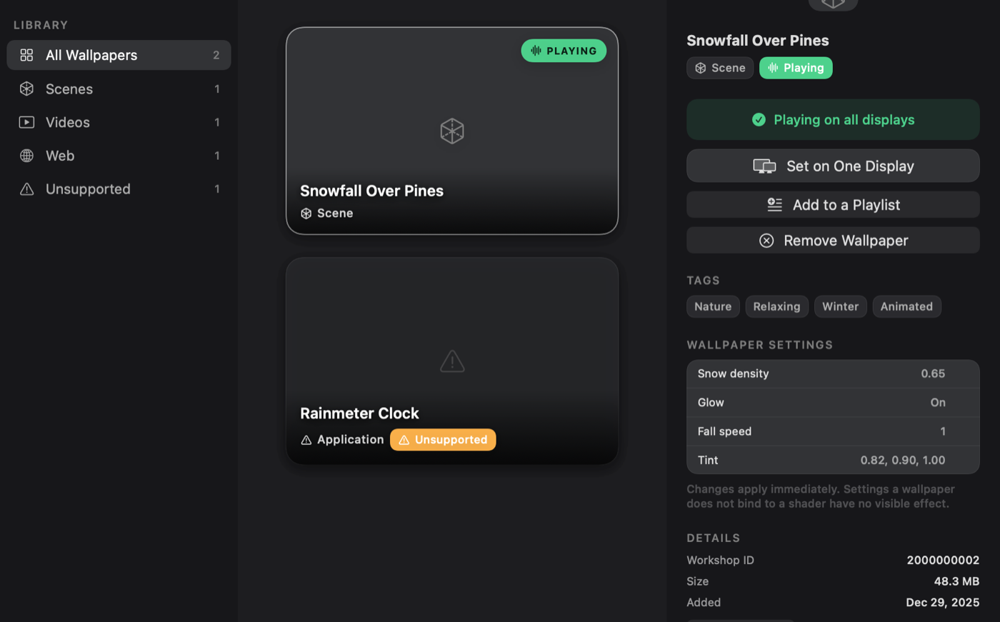
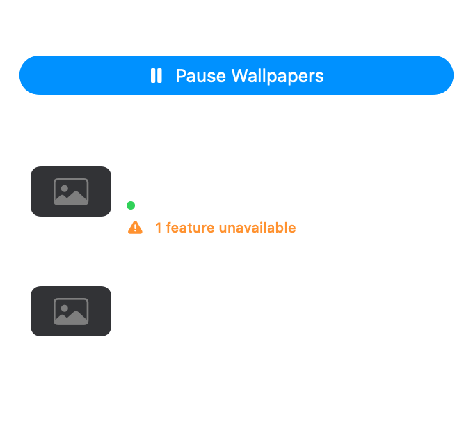
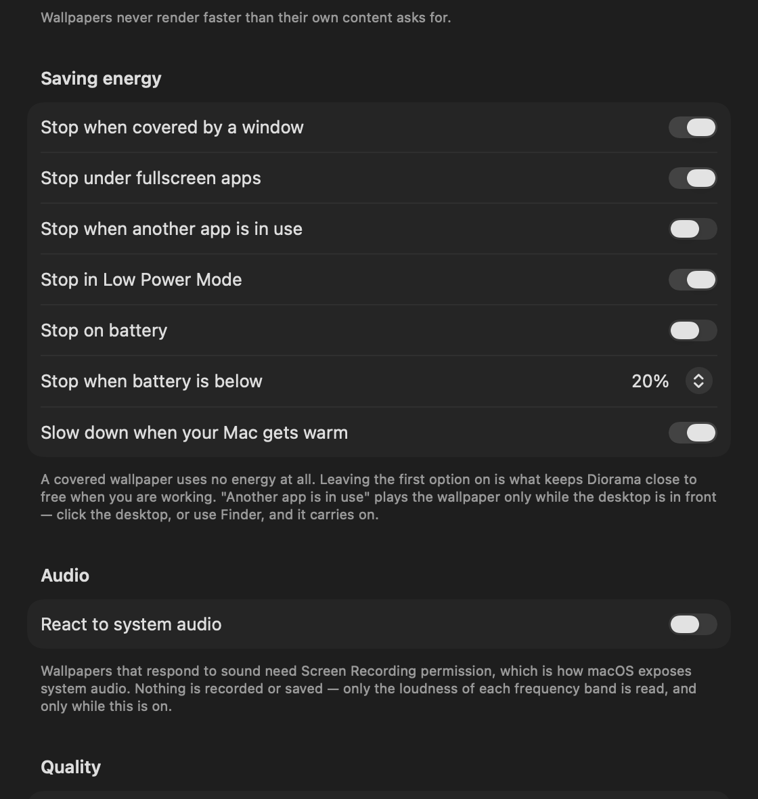

<div align="center">

# Diorama

**Live wallpapers for macOS. Plays your Wallpaper Engine library natively.**

Scene wallpapers rendered in Metal, plus video, web, images and GIFs.
Nothing leaves your Mac — no account, no server, and no networking code in the app at all.

[](https://github.com/aaronkoolkoder/wallpaperapp/actions/workflows/ci.yml)


[](LICENSE)

</div>



> Working codename. Not affiliated with, or endorsed by, Wallpaper Engine or Valve.

## What it is

Wallpaper Engine is a Windows application. If you have a Workshop library and a Mac, the
wallpapers are just files sitting in a folder — Diorama reads that folder and plays them.

Scene wallpapers are the interesting ones: they are not videos but little scene graphs, with
layered sprites, particle systems, camera parallax, post-processing chains and their own GLSL
shaders. Diorama parses the `.pkg` archives and `.tex` textures, translates each wallpaper's
shaders to Metal when it imports them, and renders the scene natively. Anything it cannot
translate falls back to a built-in approximation and is **reported by name** rather than silently
flattened, so a wallpaper that looks slightly wrong tells you which part of it was not supported.

- **Scenes** — layers, materials, parallax, particles, animated (GIF) textures, timeline
  animations, effect chains (bloom, blur, vignette, chromatic aberration, sharpen, pixelate, god
  rays), SceneScript, and text layers in the fonts the wallpaper ships with. Clocks tell the time.
- **Video** — H.264 and HEVC through AVFoundation; the ten videos in the test library run
  from 1080p to 4K60 and 1440p120.
- **Web** — runs in a WKWebView with the network blocked; the report names any site it asked for.
- **Images and GIFs**.
- **Per-wallpaper settings** — the sliders, switches and colours the author exposed, edited live.
- **Per display** — a different wallpaper on each monitor, and playlists that rotate them.
- **Audio reactivity** — optional, and only with Screen Recording permission, which is how macOS
  exposes system audio. Nothing is recorded: only the loudness of each frequency band is read.

## Install

Download the `.dmg` from [Releases](https://github.com/aaronkoolkoder/wallpaperapp/releases), open
it, and drag **Diorama** into **Applications**. Requires **macOS 26 (Tahoe)** on **Apple silicon**.

> **On first launch, right-click the app and choose Open.**
>
> Builds are signed ad-hoc rather than with an Apple Developer ID, so macOS says the developer
> cannot be verified. Right-click → Open gets past it once; it opens normally afterwards.
> Double-clicking the first time only offers to move it to the Bin — that is Gatekeeper, not a
> broken download. Removing the warning entirely needs a paid Developer ID and notarisation.

Building it yourself avoids this entirely — a locally built app never picks up the quarantine
attribute a browser attaches to downloads. See [Build from source](#build-from-source).

### Getting your wallpapers across

On the PC, the library lives here:

```
C:\Program Files (x86)\Steam\steamapps\workshop\content\431960
```

Copy that folder to your Mac by any means — AirDrop, USB, a shared folder — then point Diorama at
it on first launch. Nothing is uploaded anywhere, and Diorama never talks to Steam.

## Using it

Diorama runs in the background: a wallpaper and a menu bar icon, with no Dock icon. The menu bar
icon opens a panel showing what is playing on each display, with a ✕ to take one off.



Opening Diorama from Finder, Launchpad or Spotlight brings up its one window: the library, with
**Settings** as a second group in the same sidebar (⌘L and ⌘, go straight to either). Closing the
window leaves the wallpaper running. Select a wallpaper to set it, put it on one display, add it
to a playlist, or remove it.

Nothing starts Diorama on its own — it has no Dock icon and no background agent — so setting a
wallpaper asks, once, to open it at login. That is what makes a wallpaper survive a restart:
without it, a Mac that reboots comes back showing a still of the wallpaper rather than the
wallpaper. The switch is in Settings → General, and turning it off there is final.

### Energy

A wallpaper nobody can see should cost nothing, so a covered one stops completely. Everything
about that is adjustable.



## How well it works, measured

Against a real Steam Workshop library of **114 wallpapers** — not synthetic fixtures:

| | |
|---|---|
| Indexed | 112 of 114 |
| Playable | 73 |
| Scenes that open and build layers | **59 of 59** |
| Layers built across them | 273 |
| Effects running the author's own shaders | 282 of 293 |
| Scenes that fail to open | 0 |

The 39 unplayable ones are honest failures and the report says which: 36 have no content file in
the folder at all (only `project.json` and a preview came across), two are settings presets for
other wallpapers, and one names a video that is not there.

What is still missing is fidelity rather than loading. Materials name Wallpaper Engine's own
built-in shaders — `genericimage2`, includes like `common.h` — which ship with that application
rather than inside wallpapers, so they fall back to approximations; the same goes for its stock
particle sprites and Windows fonts. A few particle behaviours are not implemented, and video
textures show their first frame rather than playing. Every wallpaper's report lists what applies
to it. Run it against your own library:

```bash
swift run -c release wetool report /path/to/431960 --json baseline.json
```

### Performance

M5 Pro, 3024×1964 Retina, on battery. Percent of **one** core.

| State | CPU |
|---|---|
| Covered by any window | **0%** |
| Static image / scene preview | **0%** |
| Scene, 3 layers | **0.3%** |
| Scene, 900 particles | **0.1%** |
| Scene, particles + bloom chain | **0.1–0.2%** |
| Scene, 2 scripted properties | **0.3–0.5%** |
| Video, 1080p H.264 | **3.2%** |
| Idle, no wallpaper | **0%** (45 MB RSS) |

Real Workshop content costs more than purpose-built benchmarks. Rendering each of the 59 scenes
in the library above at 3024×1964 and 30 fps, through the same composition the desktop runs,
takes a median of **0.9%** of one core, with 90% of scenes under **2.5%** and the most expensive
at **5.4%** — best of three runs each, because the spread between runs on one machine is
scheduling rather than the renderer. That figure is measured offscreen, so it leaves out what the
window server spends putting each frame on the display. The ten video wallpapers — 1080p up to
4K60 and 1440p120 — take **1–5%**.

Video misses its sub-1% target; the cause is understood and written up in
[PLAN.md](PLAN.md) §6.1 rather than glossed over.

## Build from source

```bash
# Once: builds glslang and SPIRV-Cross from pinned tags.
brew install cmake ninja
Scripts/vendor-shader-tools.sh
```

```bash
swift build && swift test
Scripts/install.sh release      # builds and installs into /Applications
```

Building the installer needs two Python packages, because the DMG window layout is written
straight into a `.DS_Store` — every other recipe scripts Finder over AppleScript, which needs
Automation permission: a prompt locally and a hang in CI.

```bash
python3 -m venv .dmgvenv && .dmgvenv/bin/pip install ds_store mac_alias
DMG_PYTHON="$PWD/.dmgvenv/bin/python" Scripts/make-dmg.sh release
```

### wetool

A CLI for inspecting content without launching the app.

```bash
swift run wetool scan ~/Wallpapers            # index a library and summarise it
swift run wetool report ~/Wallpapers          # audit every scene; rank what is missing
swift run wetool pkg list scene.pkg           # list package entries
swift run wetool pkg extract scene.pkg out/   # unpack
swift run wetool tex info texture.tex         # describe a texture
swift run wetool scene info <dir> --rects     # layers, and where each lands on screen
swift run wetool scene render <dir> out.png 1920x1080
swift run wetool scene bench <dir>            # CPU and GPU per frame
```

`report` ranks missing features by **how many wallpapers each affects**, so the backlog is ordered
by what actually bites. `scene render` draws a frame with no window and no display, through the
same composition the desktop uses — the golden-image harness, and the fastest way to debug a
scene without one running on your desktop.

### Diagnostics

| Variable | Effect |
|---|---|
| `DIORAMA_FORCE_RENDER=1` | Ignore occlusion suspension, so the render path can be measured without clearing the desktop |
| `DIORAMA_LIBRARY=<path>` | Import a folder without the file panel |
| `DIORAMA_PLAY=<id>` | Start a wallpaper by Workshop ID once the scan finishes |
| `DIORAMA_RENDER_GUI=<dir>` | Draw the interface to PNGs and exit |

The app logs what it decides, which is usually the fastest way to see why a wallpaper is not
drawing:

```bash
log show --last 10m --info --predicate 'subsystem == "app.diorama"' --style compact
```

## How it is put together

| Module | Role |
|---|---|
| `WEFormat` | `.pkg` / `.tex` / scene JSON parsing. No GPU, no UI. |
| `ShaderTranspiler` | Wallpaper Engine GLSL front-end → MSL |
| `MetalRenderer` | Render graph, FBO pool, texture and pipeline caches |
| `SceneEngine` | Scene graph, properties, runtime |
| `WallpaperKit` | Desktop surfaces, display topology, power policy |
| `PlayerCore` | Backends: video, web, image, scene |
| `LibraryKit` | Import, index, thumbnails |
| `Diagnostics` | Compatibility reports, performance sampling |

[PLAN.md](PLAN.md) has the full build plan, the binary format notes, and the milestones.

## Legal, licensing and privacy

Source-available, **not open source** — see [LICENSE](LICENSE). You may read it and build it for
your own use; redistribution, republishing and commercial use need permission.

This project deliberately does **not** derive from the GPL-3.0 Wallpaper Engine
reimplementations, which would rule out App Store distribution. Run
`Scripts/verify-dependency.sh` on anything pulled in before using it.

- [PRIVACY.md](PRIVACY.md) — the whole policy. Nothing leaves your Mac; there is no networking
  code in the app.
- [LEGAL.md](LEGAL.md) — why reading these formats is safe ground, the working rules, and where
  the real exposure is.
- [THIRD_PARTY.md](THIRD_PARTY.md) — vendored dependencies and the licences that constrain them.

Diorama is not affiliated with or endorsed by the developer of Wallpaper Engine. It bundles no
Wallpaper Engine content, code or branding, and downloads nothing on your behalf.
